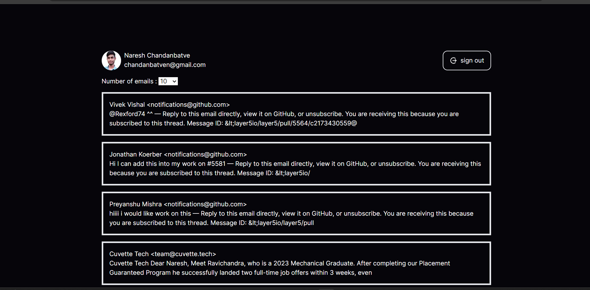

<!--
Hey, thanks for using the awesome-readme-template template.  
If you have any enhancements, then fork this project and create a pull request 
or just open an issue with the label "enhancement".

Don't forget to give this project a star for additional support ;)
Maybe you can mention me or this repo in the acknowledgements too
-->
<div align="center">

  
  <h1>Email Manager</h1>
  
  <p>
    An awsome website to mannage all your emails 
  </p>
  
  
<!-- Badges -->
<p>
  <a href="https://github.com/Naresh-chandanbatve/email-manager/graphs/contributors">
    
  </a>
  <a href="">
    
  </a>
  <a href="https://github.com/Naresh-chandanbatve/email-manager/network/members">
    
  </a>
  <a href="https://github.com/Naresh-chandanbatve/email-manager/stargazers">
    
  </a>
  <a href="https://github.com/Naresh-chandanbatve/email-manager/issues/">
    
  </a>
  <a href="https://github.com/Naresh-chandanbatve/email-manager/blob/master/LICENSE">
    
  </a>
</p>
   
<h4>
    <a href="https://email-manager-pi.vercel.app/">View Demo</a>
  <span> · </span>
    <a href="https://github.com/Naresh-chandanbatve/email-manager">Documentation</a>
  <span> · </span>
    <a href="https://github.com/Naresh-chandanbatve/email-manager/issues/">Report Bug</a>
  <span> · </span>
    <a href="https://github.com/Naresh-chandanbatve/email-manager/issues/">Request Feature</a>
  </h4>
</div>

<br />

<!-- Table of Contents -->
# :notebook_with_decorative_cover: Table of Contents

- [:notebook\_with\_decorative\_cover: Table of Contents](#notebook_with_decorative_cover-table-of-contents)
  - [:star2: About the Project](#star2-about-the-project)
    - [:camera: Screenshots](#camera-screenshots)
    - [:space\_invader: Tech Stack](#space_invader-tech-stack)
    - [:dart: Features](#dart-features)
    - [:key: Environment Variables](#key-environment-variables)
  - [:toolbox: Installation](#toolbox-installation)
    - [:running: Run Locally](#running-run-locally)
    - [:running: Run the Docker Image](#running-run-the-docker-image)
      - [:page\_with\_curl: Note:](#page_with_curl-note)
  - [:wave: Contributing](#wave-contributing)
    - [:scroll: Code of Conduct](#scroll-code-of-conduct)
  - [:warning: License](#warning-license)
  - [:handshake: Contact](#handshake-contact)

  

<!-- About the Project -->
## :star2: About the Project


<!-- Screenshots -->
### :camera: Screenshots

<div align="center"> 
  
</div>


<!-- TechStack -->
### :space_invader: Tech Stack

<details>
  <summary>Client</summary>
  <ul>
    <li><a href="https://www.typescriptlang.org/">JavaScript</a></li>
    <li><a href="https://nextjs.org/">Next.js</a></li>
    <li><a href="https://reactjs.org/">React.js</a></li>
    <li><a href="https://tailwindcss.com/">TailwindCSS</a></li>
  </ul>
</details>

<details>
  <summary>Server</summary>
  <ul>
    <li><a href="https://www.typescriptlang.org/">JavaScript</a></li>
    <li><a href="https://nextjs.com/">Next.js</a></li>
  </ul>
</details>
<!-- 
<details>
<summary>Database</summary>
  <ul>
    <li><a href="https://www.mongodb.com/">MongoDB</a></li>
  </ul>
</details> -->

<details>
<summary>DevOps</summary>
  <ul>
    <li><a href="https://www.docker.com/">Docker</a></li>
    <li><a href="https://www.jenkins.io/">Jenkins</a></li>
    <li><a href="https://circleci.com/">erraform</a></li>
  </ul>
</details>

<!-- Features -->
### :dart: Features

- Secure google sign in with NextAuth
- Fetching all your emails
- Classifying emails in different catagories (pending)
  
  

<!-- Color Reference
### :art: Color Reference

| Color             | Hex                                                                |
| ----------------- | ------------------------------------------------------------------ |
| Primary Color |  #222831 |
| Secondary Color |  #393E46 |
| Accent Color |  #00ADB5 |
| Text Color |  #EEEEEE | -->


<!-- Env Variables -->
### :key: Environment Variables

To run this project, you will need to add the following environment variables to your .env file

`GOOGLE_CLIENT_ID`

`GOOGLE_CLIENT_SECRET`

`NEXTAUTH_SECRET`

`NEXTAUTH_URL`

`REDIRECT_URI`

`REFRESH_TOKEN`

`NEXT_PUBLIC_APP_DOMAIN`

<!-- Getting Started -->
## 	:toolbox: Installation

<!-- Prerequisites
### :bangbang: Prerequisites

This project uses npm as package manager

```bash
 npm install --global yarn
``` -->

<!-- Installation -->
<!-- ### :gear: Installation -->

<!-- Install Email-Manager with npm

```bash
  yarn install my-project
  cd my-project
``` -->
   
<!-- Running Tests -->
<!-- ### :test_tube: Running Tests

To run tests, run the following command

```bash
  yarn test test
``` -->

<!-- Run Locally -->
### :running: Run Locally

Clone the project

```bash
  git clone https://github.com/Naresh-chandanbatve/email-manager.git
```

Go to the project directory

```bash
  cd email-manager
```

Install dependencies

```bash
  npm install
```

Start the server

```bash
  npm run dev
```


### :running: Run the Docker Image

You can also run the Docker Image to get started easily.
get the Docker Image by running the following command

```bash
  docker pull nareshchandanbatve/email-manager:latest
```

Run the docker image by running the following command

```bash
  docker run -p 3000:3000 --env-file ./.env nareshchandanbatve/email-manager:latest
```

#### :page_with_curl: Note: 
you must have the .env file with all the environment variables listed above


<!-- Deployment -->
<!-- ### :triangular_flag_on_post: Deployment

To deploy this project run

```bash
  yarn deploy
``` -->


<!-- Usage -->
<!-- ## :eyes: Usage -->

<!-- Use this space to tell a little more about your project and how it can be used. Show additional screenshots, code samples, demos or link to other resources.


```javascript
import Component from 'my-project'

function App() {
  return <Component />
}
``` -->

<!-- Roadmap -->
<!-- ## :compass: Roadmap

* [x] Todo 1
* [ ] Todo 2 -->


<!-- Contributing -->
## :wave: Contributing

<a href="https://github.com/Naresh-chandanbatve/email-manager/graphs/contributors">
  
</a>


Contributions are always welcome!

See `CONRIBUTING.md` for ways to get started.


<!-- Code of Conduct -->
### :scroll: Code of Conduct

Please read the [Code of Conduct](https://github.com/Naresh-chandanbatve/email-manager/blob/master/CODE_OF_CONDUCT.md)

<!-- FAQ -->
<!-- ## :grey_question: FAQ

- Question 1

  + Answer 1

- Question 2

  + Answer 2 -->


<!-- License -->
## :warning: License

Distributed under the MIT License. See LICENSE.txt for more information.


<!-- Contact -->
## :handshake: Contact

Naresh Chandanbatve - [@Nareshchandanb1](https://twitter.com/Nareshchandanb1) - chandanbatven@gmail.com

Project Link: [https://github.com/Naresh-chandanbatve/email-manager](https://github.com/Naresh-chandanbatve/email-manager)


<!-- Acknowledgments
## :gem: Acknowledgements

Use this section to mention useful resources and libraries that you have used in your projects.

 - [Shields.io](https://shields.io/)
 - [Awesome README](https://github.com/matiassingers/awesome-readme)
 - [Emoji Cheat Sheet](https://github.com/ikatyang/emoji-cheat-sheet/blob/master/README.md#travel--places)
 - [Readme Template](https://github.com/othneildrew/Best-README-Template)
 -->
